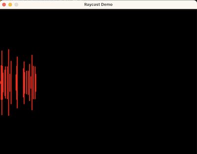
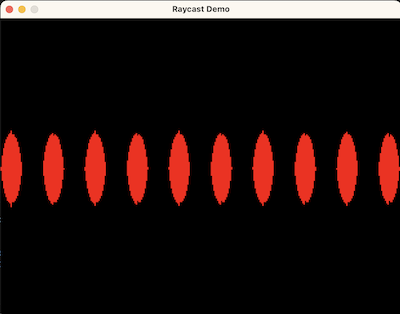
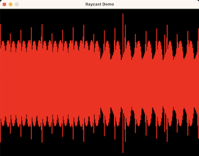
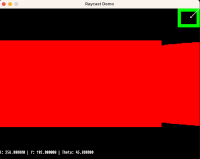

# Raycast Renderer
A simple raycasting renderer written in C using the SDL2 library.

## Dependencies
SDL2 is required, homebrew installs to /opt/homebrew/Cellar/sdl2 however I could not get this to work so it should instead be manually installed to /Library/Frameworks. The makefile will likely need to be edited to work on Windows/Linux.

## Build Instructions
~~~
make all
~~~

## Devlog
Here are a collection of progress images to show how the renderer developed.

### 13/12/24

### 13/12/24

### 14/12/24

### 15/12/24

### 24/12/24
After taking a few days off, I ventured off on a new git branch to start semi-fresh.
I built in debugging tools such as the mini-map and readout from the ground up as I was determined to succeed.
It was also now that I realised that the Math.h trigonometry functions take radian arguments, not degrees...
